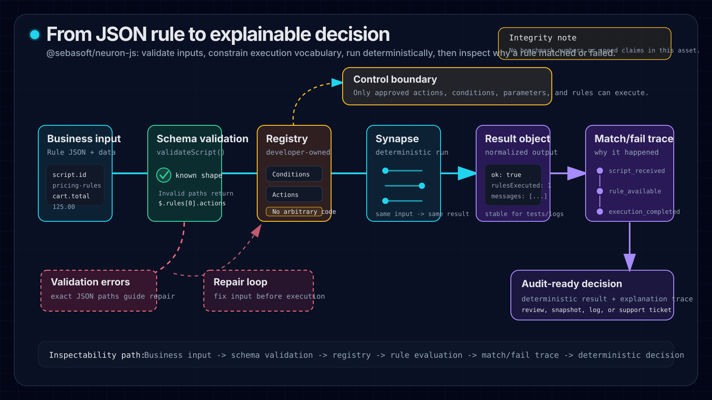

<p align="center">
  
</p>

# neuron-js

> **AI-friendly TypeScript rules engine for serializable JSON business rules and deterministic workflow decisions.**

[](https://opensource.org/licenses/MIT)
[](https://socket.dev/npm/package/@sebasoft/neuron-js)
[](https://nodejs.org)
[](https://github.com/SebaSOFT/neuron-js/actions)

`neuron-js` lets teams define business rules and workflow decisions as pure JSON, execute them deterministically in Node.js or the browser, and extend the rule vocabulary with TypeScript actions, conditions, parameters, rules, and lifecycle hooks.

Use it when hardcoded `if/else` logic is too rigid, but a heavyweight workflow or BPMN platform is too much machinery.

## Links

- Documentation: <https://sebasoft.github.io/neuron-js/>
- npm: <https://www.npmjs.com/package/@sebasoft/neuron-js>
- GitHub: <https://github.com/SebaSOFT/neuron-js>
- Examples: [`examples/`](examples/) with pricing, eligibility, workflow-routing, n8n, and LangGraph scenarios
- Schemas and validation docs: [`docs/schemas-validation-explainability.md`](docs/schemas-validation-explainability.md)
- AI-readable docs: [`docs/ai-coding-assistants.md`](docs/ai-coding-assistants.md), [`docs/public/llms.txt`](docs/public/llms.txt), and the official [`neuron-js` AI skill](docs/public/skills/neuron-js/SKILL.md)
- Comparison and migration guides: [`docs/comparisons/`](docs/comparisons/) for json-rules-engine, JsonLogic, node-rules, and if/else migrations
- Workflow automation recipes: [`docs/integrations/`](docs/integrations/) for n8n deterministic routing and LangGraph decision nodes
- Proof assets: [`docs/benchmarks/methodology.md`](docs/benchmarks/methodology.md) for the benchmark contract and [`docs/benchmarks/assets/generated/explainability-trace-diagram.md`](docs/benchmarks/assets/generated/explainability-trace-diagram.md) for the inspectable trace diagram

---

## Why neuron-js?

Use `neuron-js` when:

- Business rules need to be stored, versioned, audited, or changed without redeploying code.
- Backend and frontend code need to share the same deterministic rule definitions.
- AI assistants or workflow tools generate JSON rules that still need developer-owned validation and execution boundaries.
- Product, pricing, eligibility, routing, or automation decisions change faster than application deployments.
- A full workflow platform is too heavy, but hardcoded conditional logic is too brittle.

Do not use `neuron-js` when a simple hardcoded condition is clearer and rarely changes, when arbitrary user code execution is required, or when you need a full BPMN/process orchestration platform.

## Public proof assets

Neuron-JS proof material is published as methodology, measured benchmarks, and inspectability artifacts. Benchmark numbers come from a real `actual_benchmark` harness run only — reproduce them with `yarn benchmark`.

<p align="center">
  
</p>

### Benchmark results

Measured throughput, cold-start, bundle-size, validation, and explanation overhead across the pricing, eligibility, and workflow-routing scenarios, compared against `json-rules-engine`, `json-logic-js`, a hand-coded TypeScript baseline, and `rule-engine-js`. See the full charts, results table, and provenance:

- Benchmark results (charts + data + provenance): [`docs/benchmarks/results.md`](docs/benchmarks/results.md)
- Reproduce locally: `yarn benchmark` then `yarn benchmark:charts`
- Raw measured output: [`benchmarks/results/latest.actual.json`](benchmarks/results/latest.actual.json)

### Methodology and inspectability

- Benchmark methodology (how each metric is measured): [`docs/benchmarks/methodology.md`](docs/benchmarks/methodology.md)
- AI-rule safety (why AI-drafted rules need validation): [`docs/benchmarks/ai-rule-safety.md`](docs/benchmarks/ai-rule-safety.md)
- Proof overview and explainability diagram: [`docs/benchmarks/`](docs/benchmarks/)

---

## ✨ Features

- 🛠 **Pluggable TypeScript registry**: Register custom Actions, Conditions, Parameters, and Rules.
- 📦 **JSON business rules**: Store, transmit, version, and audit logic as serializable JSON.
- ⚡ **Deterministic execution**: Run predictable workflow and business decisions in Node.js or the browser.
- 🪝 **Lifecycle hooks**: Monitor script, rule, action, and error events around execution.
- 🌓 **Dual-module support**: Native ESM and CommonJS bundles via `tshy`.

---

## 🚀 Quick Start

### Installation

```bash
yarn add @sebasoft/neuron-js
# or
npm install @sebasoft/neuron-js
```

### Executable rule example

```typescript
import { Neuron, Synapse } from '@sebasoft/neuron-js';

const neuron = new Neuron();
const synapse = new Synapse(neuron);

const script = {
  id: 'pricing-decision',
  rules: [
    {
      id: 'vip-discount-rule',
      type: 'simple_rule',
      options: {},
      conditions: [
        {
          id: 'minimum-order-value',
          type: 'compare_two_numbers',
          options: {},
          params: [
            { id: 'order-total', name: 'op1', type: 'simple_number', value: '125', options: {} },
            { id: 'comparison', name: 'comp', type: 'comparator', value: '>', options: {} },
            { id: 'threshold', name: 'op2', type: 'simple_number', value: '100', options: {} }
          ]
        }
      ],
      actions: [
        {
          id: 'calculate-discount',
          type: 'add_two_numbers',
          options: {},
          params: [
            { id: 'base-discount', name: 'op1', type: 'simple_number', value: '10', options: {} },
            { id: 'vip-bonus', name: 'op2', type: 'simple_number', value: '5', options: {} }
          ]
        }
      ]
    }
  ]
};

const context = { messages: [], state: {} };
const result = synapse.execute(script, context);

console.log(result.isSuccessful()); // true
console.log(result.value); // 1 rule executed
console.log(result.context.messages.map((message) => message.text)); // includes "Sum result: 15"
```

---

## 🧬 Core Concepts

### Neuron: the registry

The `Neuron` registry knows which parameter, condition, action, and rule types are available. Applications keep control of this registry so generated or stored JSON can only use developer-approved capabilities.

### Synapse: the executor

The `Synapse` engine connects a `Neuron` registry with a serializable script and an execution context. It evaluates rules, applies actions, and emits lifecycle hooks.

### Rule

A Rule is a logical unit containing conditions and actions.

- **No Conditions**: the rule is treated as always eligible.
- **No Actions**: the rule evaluates conditions but performs no operation.

### Elements

- **Action**: An operation to perform, such as writing to context, calculating a value, or triggering an approved side effect.
- **Condition**: A predicate that decides whether a rule should run.
- **Parameter**: A serializable input for actions and conditions.

---

## 💾 Execution Context & State

The `ExecutionContext` is a shared state object that persists through script execution. Actions and conditions can read from it, and actions can return updated context for later rules.

```typescript
interface ExecutionContext {
  messages: { type: string; text: string }[];
  state: Record<string, any>;
}
```

---

## Roadmap-aligned docs

The current public surface includes installation, positioning, core concepts, runtime architecture, and runnable examples.

Available adoption assets:

- Runnable examples: [`examples/`](examples/) including n8n and LangGraph workflow automation recipes
- JSON Schemas, validation, and explain output: [`docs/schemas-validation-explainability.md`](docs/schemas-validation-explainability.md)
- Measured benchmarks, methodology, and AI-rule-safety proof: [`docs/benchmarks/`](docs/benchmarks/)
- Comparison and migration guides: [`docs/comparisons/`](docs/comparisons/) for choosing and migrating from json-rules-engine, JsonLogic, node-rules, and hand-written if/else
- AI-readable docs: [`docs/ai-coding-assistants.md`](docs/ai-coding-assistants.md), [`docs/public/llms.txt`](docs/public/llms.txt), [`docs/public/llms-full.txt`](docs/public/llms-full.txt), and [`docs/public/skills/neuron-js/SKILL.md`](docs/public/skills/neuron-js/SKILL.md)

---

## 🛠 Development

We use a modern toolchain for high-signal development:

- **Linting & Formatting**: [Biome](https://biomejs.dev/)
- **Testing**: [Vitest](https://vitest.dev/)
- **Build**: [tshy](https://github.com/isaacs/tshy)
- **Runtime**: [Node.js 24+](https://nodejs.org/)

### Commands

```bash
yarn test    # Run test suite
yarn lint    # Check linting and formatting
yarn examples # Build and verify runnable examples
yarn build   # Generate ESM/CJS bundles
yarn docs:build # Build API docs and VitePress site
```

---

## 📄 License

MIT © [SebaSOFT](https://github.com/SebaSOFT)
