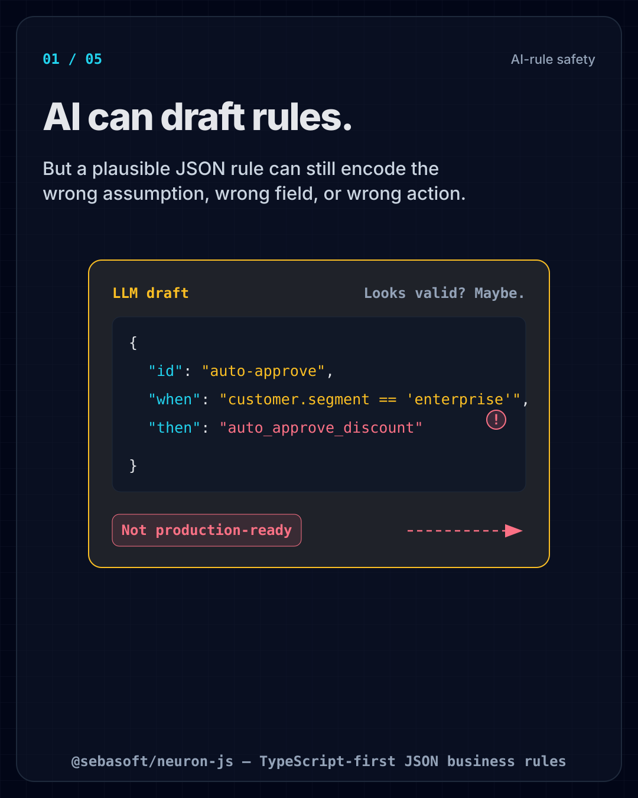
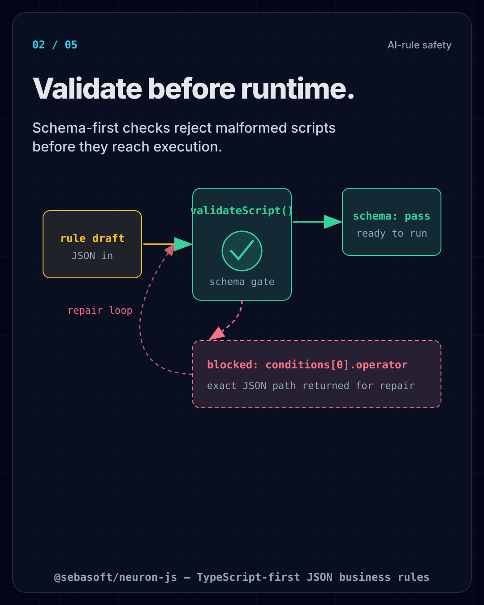
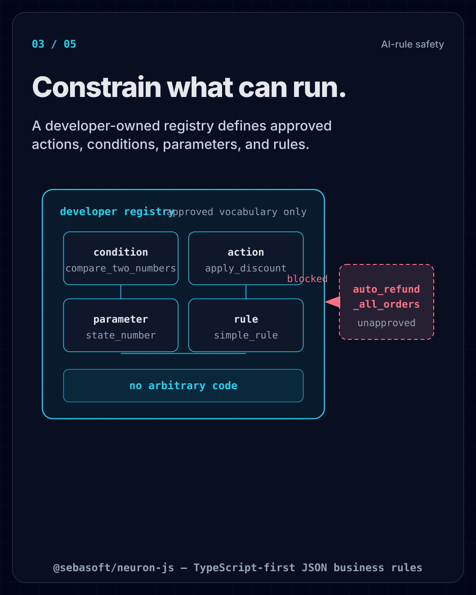
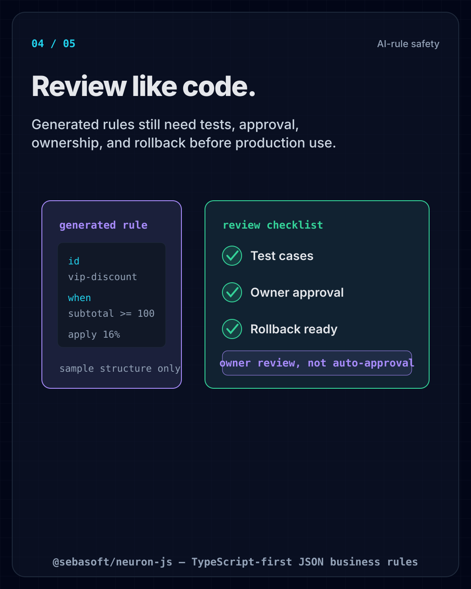
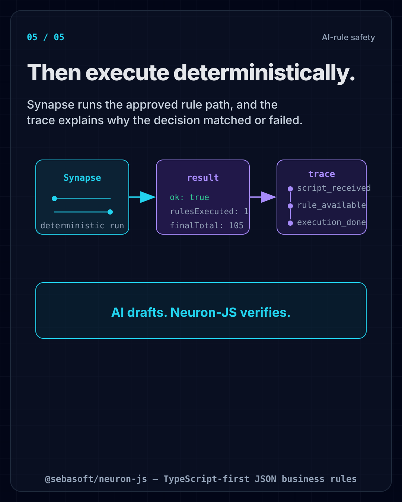

# AI-rule safety

LLMs are great at *drafting* JSON business rules — and that's exactly the risk. A
plausible-looking rule can still encode the wrong field, the wrong threshold, or the wrong
action. Neuron-JS exists so AI-drafted rules become **safe to run**: schema-validated,
constrained to a developer-owned vocabulary, reviewable like code, and explainable after the
fact.

> AI drafts. Neuron-JS verifies.

## 1. AI can draft rules

A plausible JSON rule can still encode the wrong assumption, field, or action — it is not
production-ready on its own.

## 2. Validate before runtime

Schema-first checks (`validateScript`) reject malformed scripts before they ever execute, and
return the exact JSON path to fix.

## 3. Constrain what can run

A developer-owned registry defines the approved actions, conditions, parameters, and rules.
Anything outside that vocabulary simply cannot execute — no arbitrary code.

## 4. Review like code

Generated rules are serializable data, so they go through the same governance as code: tests,
owner approval, and rollback — never automatic AI approval.

## 5. Then execute deterministically

Synapse runs the approved rule path deterministically, and the explanation trace shows why the
decision matched or failed — ready for audit, logs, or a support ticket.

## In short

`Validate → constrain → test → approve → execute → explain.` Deterministic workflow logic with
auditability is the guardrail that makes AI-assisted business rules safe to ship.
