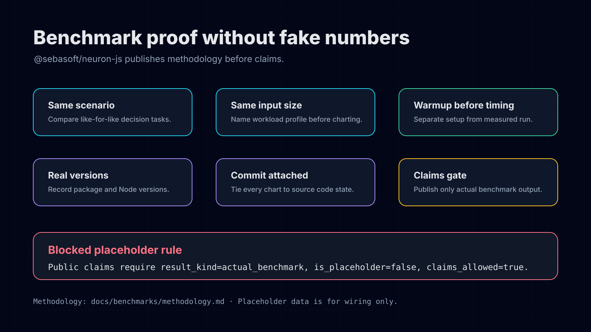

# Benchmark methodology

How the [benchmark results](./results.md) are produced. The benchmarks are intentionally
conservative: no number is published until the harness emits `result_kind: "actual_benchmark"`
with `is_placeholder: false` and `claims_allowed: true`. Reproduce any result locally with
`yarn benchmark` (raw output: `benchmarks/results/latest.actual.json`).

## Competitor set

| Engine | Adapter key | Role |
| --- | --- | --- |
| Neuron-JS | `@sebasoft/neuron-js` | First-party rules engine under test. |
| json-rules-engine | `json-rules-engine` | Closest default Node.js JSON rules-engine competitor. |
| JsonLogic | `json-logic-js` | Portable JSON predicate format competitor. |
| Hand-coded TypeScript | `hand-coded-typescript` | Baseline for direct conditional logic without engine overhead. |
| rule-engine-js | `rule-engine-js` | Smaller modern competitor selected because it installs/builds in this repository. |

## Scenario matrix

| Scenario | Inputs represented | Why it exists |
| --- | --- | --- |
| `pricing-discount` | tier, region, coupon, cart total, account age | Shows business-rule pricing decisions and validation/explanation overhead. |
| `eligibility-approval` | age, country, verification status, risk score, account flags | Shows policy/approval style decisions with clear pass/fail outcomes. |
| `workflow-routing` | channel, urgency, customer segment, confidence score, escalation flags | Shows deterministic workflow routing and trace usefulness. |

## Input-size matrix

| Profile | Decisions | Usage |
| --- | ---: | --- |
| `smoke` | 100 | Correctness and trace sanity. |
| `small` | 1,000 | Local development feedback. |
| `medium` | 10,000 | Chartable throughput. |
| `large` | 100,000 | Optional; run only if runtime remains practical in CI/local machines. |

## How each metric is measured

- **Fairness gate.** Before timing, every engine must reproduce the scenario's canonical decision (e.g. pricing `finalTotal: 105`, `discountAmount: 20`); the run aborts on any mismatch, so all engines are timed doing equivalent work.
- **Throughput / p50 / p95.** Warmup iterations run untimed, then measured iterations run in batches; per-decision latency is averaged per batch (so per-call timer overhead does not dominate sub-microsecond engines). Throughput is total measured decisions over total measured seconds.
- **Cold start.** Median wall-clock across several fresh Node processes to import the engine and execute the first decision; the timer starts before the import, so Node's own startup is excluded.
- **Bundle size.** `esbuild` bundles and minifies the engine's public surface (ESM, node platform); the output byte length is recorded. The hand-coded baseline has no library dependency (`0`).
- **Validation / explanation overhead.** Neuron-JS only: the per-decision latency delta of running `validateScript` (resp. `explainExecution`) around an otherwise identical execution. The other engines provide no equivalent step, so their measured delta is `0`.

## Result fields

Each row in the results file carries these fields (units and definitions are mirrored in the
machine-readable [result schema](/benchmarks/results.schema.json)):

| Field | Unit | Meaning |
| --- | --- | --- |
| `engine` | identifier | Engine under test (fixed enum). |
| `scenario` | identifier | Scenario slug. |
| `input_size` | profile | Named workload profile (`smoke`/`small`/`medium`/`large`). |
| `warmup_iterations` | decisions | Unmeasured warmup decisions before timing. |
| `measured_iterations` | decisions | Measured decisions in the timing window. |
| `throughput_decisions_per_second` | decisions/second | Measured decisions ÷ elapsed measured seconds. |
| `p50_ms` / `p95_ms` | milliseconds | Median / 95th-percentile per-decision latency. |
| `cold_start_ms` | milliseconds | Import + first decision in a fresh process. |
| `bundle_size_minified_bytes` | bytes | Minified bundle of the engine's public surface. |
| `validation_overhead_ms` | milliseconds | Validation-enabled vs disabled per-decision delta (Neuron-JS). |
| `explanation_overhead_ms` | milliseconds | Trace-enabled vs disabled per-decision delta (Neuron-JS). |
| `node_version` / `package_version` / `commit_sha` | provenance | Run environment and source state. |

## No fabricated numbers

Numbers are published only from a measured `actual_benchmark` run; placeholder fixtures are
never used for public claims. Results reflect one machine, Node version, and commit — reproduce
them before citing, and avoid "fastest"/"best" framing beyond what a named scenario and input
size support.
