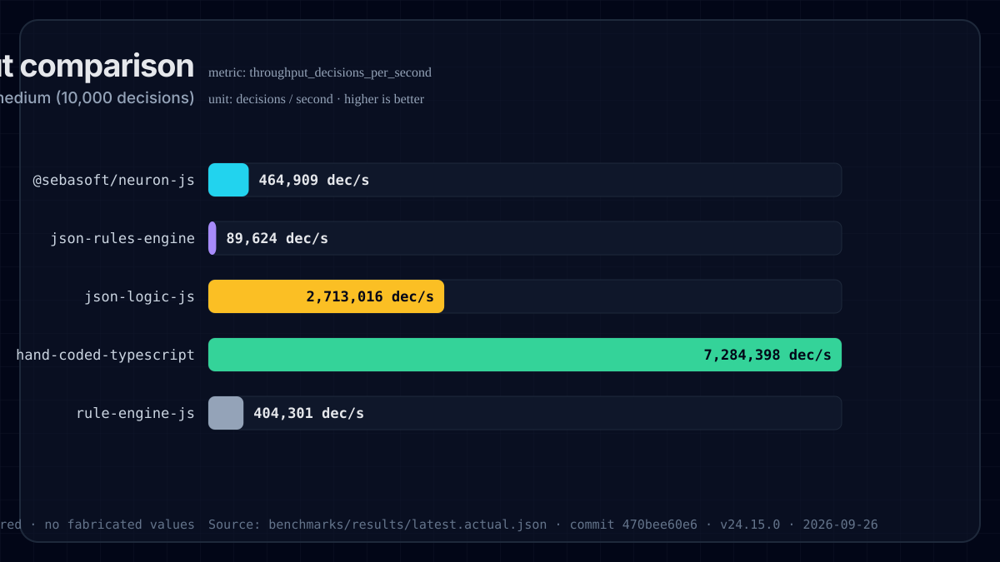
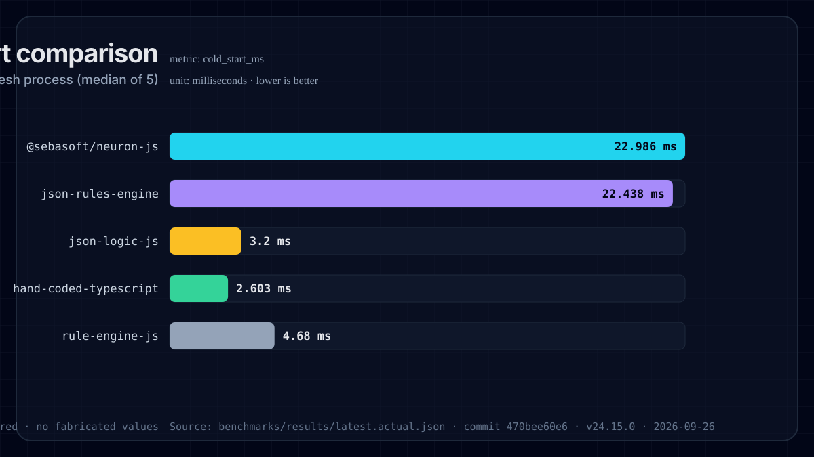
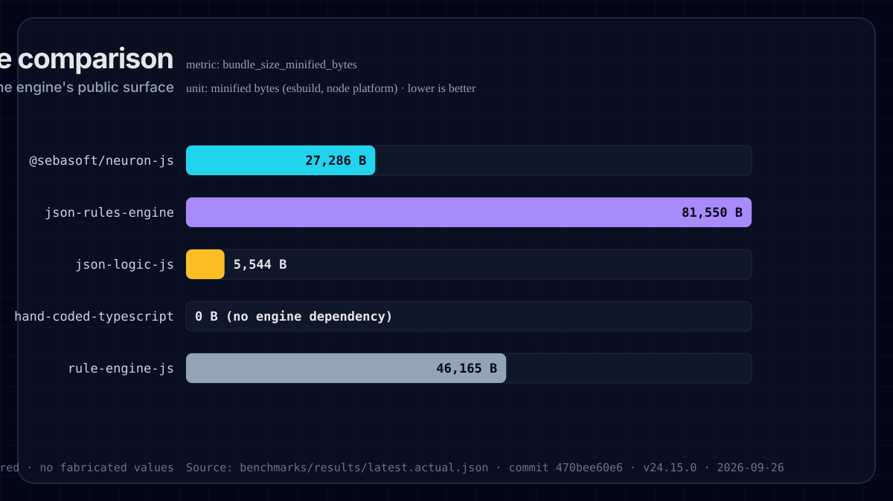
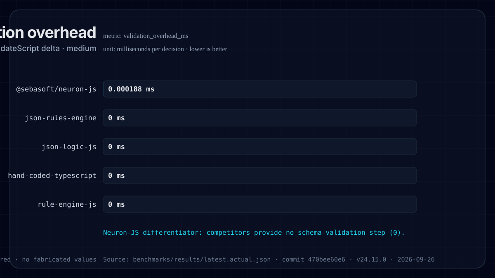
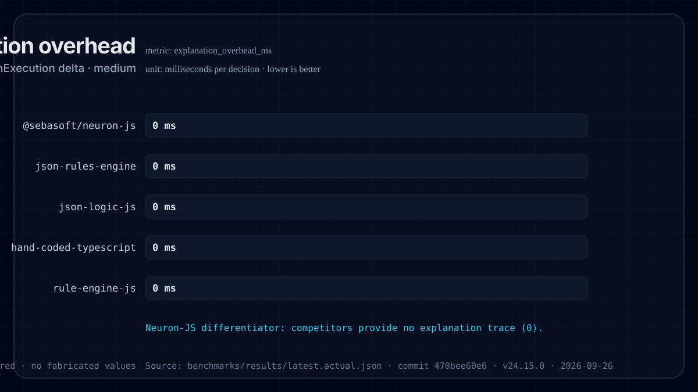

<!-- GENERATED by benchmarks/charts/generate.ts from benchmarks/results/latest.actual.json. Do not edit by hand; run `yarn benchmark && yarn benchmark:charts`. -->
# Benchmark results

These are **measured** results produced by the Neuron-JS benchmark harness
(`yarn benchmark`). They compare `@sebasoft/neuron-js` against `json-rules-engine`,
`json-logic-js`, a hand-coded TypeScript baseline, and `rule-engine-js` across the
pricing, eligibility, and workflow-routing scenarios. See the
[methodology](./methodology) for how each metric is collected.

Numbers reflect a single machine, Node version, and commit; reproduce locally before
citing. No value on this page is hand-entered — charts and the table below are generated
from the same source file.

## Provenance

| Field | Value |
| --- | --- |
| Generated | `2026-06-23T13:04:51.282Z` |
| Node | `v24.14.1` |
| Commit | `d4f8c5af046663186d2a3dd7f1e9958594d0b9b0` |
| Neuron-JS version | `0.5.2` |
| Command | `yarn benchmark` |
| Raw source | `benchmarks/results/latest.actual.json` |

## Throughput comparison

metric: `throughput_decisions_per_second` · decisions / second · _higher is better_

## Cold-start comparison

metric: `cold_start_ms` · milliseconds · _lower is better_

## Bundle-size comparison

metric: `bundle_size_minified_bytes` · minified bytes (esbuild, node platform) · _lower is better_

## Validation overhead

metric: `validation_overhead_ms` · milliseconds per decision · _lower is better_

Neuron-JS differentiator: competitors provide no schema-validation step (0).

## Explanation overhead

metric: `explanation_overhead_ms` · milliseconds per decision · _lower is better_

Neuron-JS differentiator: competitors provide no explanation trace (0).

## Full results (medium · 10,000 decisions)

Throughput is decisions/second (higher is better); all latency, cold-start, and overhead
columns are milliseconds (lower is better); bundle size is minified bytes.

| Engine | Scenario | Throughput | p50 ms | p95 ms | Cold start ms | Bundle B | Validation ms | Explanation ms |
| --- | --- | ---: | ---: | ---: | ---: | ---: | ---: | ---: |
| `@sebasoft/neuron-js` | pricing-discount | 1,202,875 | 0.000775 | 0.001285 | 7.869 | 13,040 | 0.000269 | 0 |
| `@sebasoft/neuron-js` | eligibility-approval | 1,291,461 | 0.000731 | 0.001087 | 7.869 | 13,040 | 0.000446 | 0.000066 |
| `@sebasoft/neuron-js` | workflow-routing | 1,104,332 | 0.000833 | 0.001489 | 7.869 | 13,040 | 0.00047 | 0.000069 |
| `json-rules-engine` | pricing-discount | 193,994 | 0.004927 | 0.006668 | 9.976 | 81,550 | 0 | 0 |
| `json-rules-engine` | eligibility-approval | 203,481 | 0.004598 | 0.006849 | 9.976 | 81,550 | 0 | 0 |
| `json-rules-engine` | workflow-routing | 215,776 | 0.004429 | 0.005913 | 9.976 | 81,550 | 0 | 0 |
| `json-logic-js` | pricing-discount | 3,685,560 | 0.000245 | 0.000442 | 1.624 | 5,544 | 0 | 0 |
| `json-logic-js` | eligibility-approval | 4,567,338 | 0.000196 | 0.000222 | 1.624 | 5,544 | 0 | 0 |
| `json-logic-js` | workflow-routing | 5,146,127 | 0.000186 | 0.000197 | 1.624 | 5,544 | 0 | 0 |
| `hand-coded-typescript` | pricing-discount | 12,843,829 | 0.000074 | 0.000079 | 0.813 | 0 | 0 | 0 |
| `hand-coded-typescript` | eligibility-approval | 10,683,281 | 0.000083 | 0.000117 | 0.813 | 0 | 0 | 0 |
| `hand-coded-typescript` | workflow-routing | 12,085,206 | 0.000078 | 0.000087 | 0.813 | 0 | 0 | 0 |
| `rule-engine-js` | pricing-discount | 813,957 | 0.001126 | 0.001761 | 3.084 | 46,165 | 0 | 0 |
| `rule-engine-js` | eligibility-approval | 890,614 | 0.001066 | 0.001517 | 3.084 | 46,165 | 0 | 0 |
| `rule-engine-js` | workflow-routing | 832,801 | 0.00113 | 0.001667 | 3.084 | 46,165 | 0 | 0 |

Validation and explanation overhead are Neuron-JS capabilities (`validateScript`,
`explainExecution`); the other engines provide no equivalent step, so their measured
delta is `0`.
