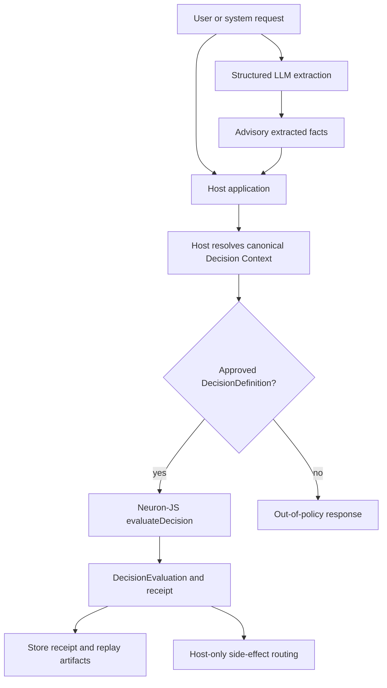
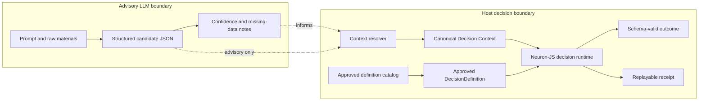
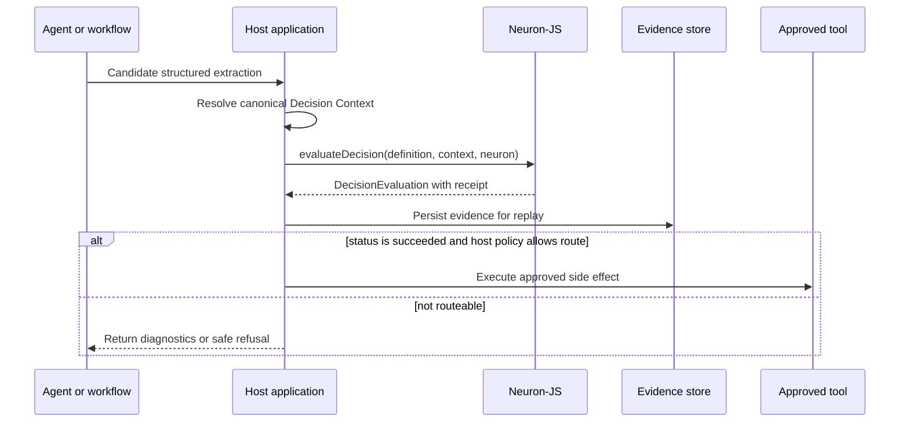

# Agentic decision architecture

This guide describes a domain-neutral architecture for systems that combine agentic extraction with deterministic Neuron-JS decisions. The central rule is explicit: structured LLM extraction is advisory only. The host application resolves the canonical Decision Context, Neuron-JS evaluates an approved DecisionDefinition, receipts provide receipt/replay evidence, and the host performs host-only side-effect routing.

Use this pattern when an agent, workflow, or assistant can propose structured inputs but the system still needs a deterministic, replayable boundary before routing downstream effects.

## End-to-end flow

The LLM can help turn natural language, documents, or conversation state into a candidate object. That object is not the Decision Context until the host validates provenance, fills defaults, resolves identities, normalizes units, drops untrusted fields, and checks authorization.

## Architecture responsibilities

| Layer | Owns | Must not own |
| --- | --- | --- |
| LLM extraction | Candidate fields, uncertainty notes, missing-data hints | Canonical context, policy approval, final routing, side effects |
| Host application | Identity, authorization, canonical Decision Context, approved definition selection, artifact storage, side-effect routing | Hidden policy encoded in prompts, runtime mutation inside Neuron-JS |
| Neuron-JS decision runtime | Definition/context validation, declared component checks, effect-free evaluation, outcome validation, receipt generation | Fetching data, persisting receipts, calling tools, sending messages, invoking LLMs |
| Tool or workflow layer | Executing host-approved effects after a successful host decision | Overriding engine status, skipping receipt capture, interpreting LLM text as policy |

## Decision model vs LLM boundary

The decision model is the versioned, reviewed, testable artifact. The LLM is an input assistant.

Boundary rules:

1. Prompts may describe extraction shape, but they do not define policy.
2. Extracted fields are untrusted until the host resolves them into canonical context.
3. The selected `DecisionDefinition` must come from a host-approved catalog, not from free-form model output.
4. Engine statuses remain technical: `succeeded`, `invalid_context`, `no_decision`, or `execution_failed`.
5. Domain consequences belong in a successful outcome and host routing code.

## Tool/skill contract

Agents and tools that participate in this flow should follow this contract:

| Step | Contract |
| --- | --- |
| Extract | Return structured candidate data plus missing-data notes. Do not claim final approval. |
| Resolve | Host validates source, identity, authorization, and schema requirements before building the canonical Decision Context. |
| Select definition | Host chooses a reviewed `DecisionDefinition` by stable id and version. The LLM may suggest a candidate id, but the host decides. |
| Evaluate | Call `evaluateDecision({ definition, context, neuron })` with an approved registry and effect-free decision-profile components. |
| Preserve evidence | Retain the receipt, definition artifact, context artifact or context hash, component manifest, runtime version, diagnostics, and trace. |
| Route effects | Only host code or an approved workflow tool performs side effects after reviewing the evaluation. Neuron-JS returns data only. |

A skill-aware agent should link to the architecture guide, the decision-runtime concept page, schemas, and the runnable generic example. It should not invent runtime LLM, MCP, UI, CLI, hosted registry, or external-service behavior.

## Receipt/replay evidence

For every evaluation, persist enough evidence to answer these questions later:

- Which `DecisionDefinition` id and version was used?
- What definition hash and component manifest hash were evaluated?
- What canonical Decision Context was used, or what canonical context hash identifies it?
- Which Neuron-JS runtime version produced the result?
- What engine status, diagnostics, outcome, and explanation trace were returned?
- Which host route, if any, consumed the result?

Replay should re-run the same retained definition and canonical context through the decision runtime. If the replayed receipt identity changes, investigate definition, context, component, or runtime drift before trusting downstream effects.

## Host-only side-effect routing

Neuron-JS never sends the side-effect request. The host decides whether the outcome is routeable, whether a human must review it, whether evidence storage succeeded, and whether an approved tool may run.

## Intentional failure paths

### Missing data

When extraction cannot supply required fields, the host should stop before evaluation or build a context that intentionally fails schema validation. Return actionable missing-data diagnostics. Do not ask Neuron-JS to infer missing domain facts.

Expected handling:

1. LLM reports missing fields in advisory output.
2. Host checks required canonical context fields.
3. Host requests more data or returns a safe incomplete-input response.
4. No side effect runs.

### Invalid context

When the host provides a canonical Decision Context that fails `definition.contextSchema`, `evaluateDecision` returns `invalid_context` before component execution.

Expected handling:

1. Preserve validation diagnostics and receipt data.
2. Do not retry by mutating the context inside Neuron-JS.
3. Fix host context resolution or request corrected input.
4. No side effect runs.

### Out-of-policy request

When the request asks for behavior outside the approved definition catalog or outside authorized host routes, the host refuses before side-effect routing.

Expected handling:

1. Ignore any LLM-suggested policy or tool call that is not host-approved.
2. Select no definition, or select a definition that returns a non-routeable outcome.
3. Return a safe refusal or escalation path.
4. Persist enough evidence to explain why the request did not route.

## Minimal adoption checklist

- Define the canonical Decision Context schema and its source-of-truth resolution rules.
- Review and approve each `DecisionDefinition` id/version before production use.
- Register only effect-free decision-profile components in the `Neuron` registry used by `evaluateDecision`.
- Add decision test vectors for `succeeded`, missing data, `invalid_context`, and out-of-policy behavior.
- Store receipts and retained artifacts needed for replay.
- Keep all side effects in host-owned routing code or explicitly approved workflow tools.

See also: [Decision runtime](./decision-runtime.md) and the [generic decision-runtime example](../../examples/generic-decision-runtime/).
